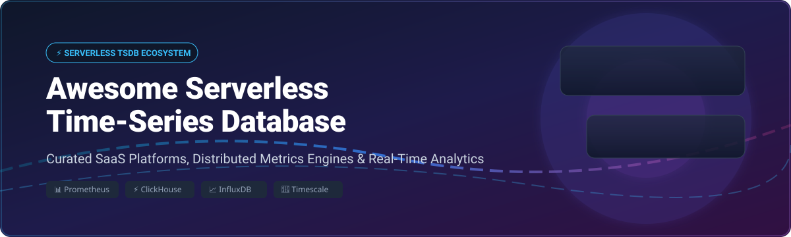

  

# 🚀 Awesome Serverless Time-Series Database 📊

## ⚡ Top Serverless Time-Series Databases, Metrics Engines & TSDB Ecosystem

A curated list of serverless time-series database (TSDB) SaaS platforms, open-source metrics storage engines, real-time columnar analytics datastores, and cloud-native observability platforms. 📈

---

## 💡 Market Overview & Analysis

The global **time-series database (TSDB) market size** is estimated at **$2.5 Billion to $3.2 Billion**, projecting growth at a ~18.5% CAGR as enterprise IoT telemetry, cloud-native Prometheus monitoring, and financial event streaming scale exponentially. 📊

The market sector is **moderately fragmented**: while cloud giants dominate hyperscale serverless infrastructure, open-source query standards (PromQL, SQL extensions) enable innovative independent vendors to thrive across specialized workloads (high-throughput ingestion, high-cardinality observability, and IoT edge storage). 🌐

---

## 📑 Table of Contents

- [☁️ SaaS & Hosted Managed Platforms](#️-saas--hosted-managed-platforms)
- [🔓 Open-Source GitHub Projects](#-open-source-github-projects)
- [🛠️ How to Contribute](#️-how-to-contribute)
- [❤️ Support & Sponsorship](#️-support--sponsorship)
- [⭐ Star History](#-star-history)
- [⚠️ Disclaimer & Best Practices](#️-disclaimer--best-practices)

---

## ☁️ SaaS & Hosted Managed Platforms

The table below details leading commercial serverless time-series database platforms, ranked in descending order by estimated company valuation / annual revenue scale. 💰

| Platform / Vendor | Market Scale / Valuation | Starting Paid Tier Pricing | Free Tier / Trial Limit | Key Focus & Use Case |
| :--- | :--- | :--- | :--- | :--- |
| **[Amazon Timestream](https://aws.amazon.com/timestream/)** | **~$1.8+ Trillion** *(AWS / Amazon Market Cap)* | $0.50 per GB ingested ($0.01 per GB/month memory storage, $0.03 per GB/month magnetic storage) | **30-day Free Trial**: 50 GB ingestion, 100 GB magnetic storage, 10 GB memory storage, 750 query execution units | Fully managed serverless TSDB scaling automatically for AWS IoT telemetry & cloud metrics. ☁️ |
| **[ClickHouse Cloud](https://clickhouse.com/)** | **~$2.0 Billion** *(Valuation)* | $67 / month minimum compute usage (Development service starting at ~$0.08/GB storage) | **30-day Free Trial**: $300 free usage credits (up to 1 TB storage) | Lightning-fast columnar analytical TSDB optimized for real-time observability & log analytics. ⚡ |
| **[Grafana Cloud / Mimir](https://grafana.com/oss/mimir/)** | **~$1.5 Billion+** *(Valuation)* | $29 / month (Pro Plan starting tier) | **Forever Free Tier**: 10,000 active series metrics, 50 GB logs, 50 GB traces, 14-day retention | Cloud-native, Prometheus-compatible enterprise long-term metrics storage & dashboarding platform. 📊 |
| **[InfluxDB Cloud](https://www.influxdata.com/)** | **~$500 Million+** *(Valuation)* | $0.002 per MB ingested ($0.002 per GB-hour query execution) | **Forever Free Tier**: 10 MB/min write rate, 5 MB/min query read rate, 30-day data retention | Dedicated time-series platform with SQL support, high cardinality engine, and IoT telemetry pipelines. 📈 |
| **[Timescale Cloud](https://www.timescale.com/)** | **~$300 Million+** *(Valuation)* | $24 / month (Starting compute cluster: 2 vCPU, 8 GB RAM) | **30-day Free Trial**: Full feature access with $300 usage credits | PostgreSQL-native time-series database with hyperfunctions, automated compression & full SQL. 🐘 |
| **[VictoriaMetrics Cloud](https://victoriametrics.com/)** | **~$50 Million+** *(Estimated Scale)* | $0.18 / GB ingested ($0.02 per 1k query requests) | **14-day Free Trial**: Full feature sandbox with $25 free usage credits | Ultra-efficient, cost-effective Prometheus-compatible backend for enterprise metrics monitoring. 🚀 |
| **[QuestDB Cloud](https://questdb.io/)** | **~$30 Million+** *(Estimated Scale)* | $0.155 / hour (~$113/month for dedicated instance) | **14-day Free Trial**: Dedicated cloud instance with $200 free usage credits | High-throughput SQL time-series database with SIMD optimization for financial & telemetry data. ⚡ |
| **[CrateDB Cloud](https://crate.io/)** | **~$30 Million+** *(Estimated Scale)* | $0.08 / hour (~$58/month starting shared node) | **14-day Free Trial**: $100 free credits for cluster deployments | Distributed SQL database for real-time sensor ingestion, industrial IoT, and spatial analytics. 🏭 |
| **[TDengine Cloud](https://tdengine.com/)** | **~$20 Million+** *(Estimated Scale)* | $0.05 / GB ingested ($0.002 per query unit) | **Forever Free Tier**: 50 GB storage, 5 GB/month ingestion, 1 million data points/day write limit | Purpose-built time-series engine with super-table model for industrial IoT & smart meter data. 🚗 |
| **[Warp 10 Cloud](https://warp10.io/)** | **~$10 Million+** *(Estimated Scale)* | €0.005 per 1,000 datapoints ingested | **14-day Free Trial**: 1,000,000 datapoints sandbox | Advanced Geo-Time-Series platform specialized for complex IoT sensor math, industrial & spatio-temporal data. 🌐 |

---

## 🔓 Open-Source GitHub Projects

The following list includes leading open-source time-series databases, metrics storage backends, and analytical datastores. Entries are ordered in **descending order by GitHub Star count**. Each star badge links directly to the repository's stargazers list. ✨

### 1. Prometheus 🔥
- **Repository**: **[prometheus/prometheus](https://github.com/prometheus/prometheus)** 
- **License**: Apache-2.0
- **Overview**: The CNCF flagship pull-based metrics collector and monitoring system. Features PromQL, alerting, and high-dimensional time-series data storage. Best for Kubernetes monitoring and cloud-native observability.

### 2. ClickHouse ⚡
- **Repository**: **[ClickHouse/ClickHouse](https://github.com/ClickHouse/ClickHouse)** 
- **License**: Apache-2.0
- **Overview**: High-performance columnar OLAP database management system capable of sub-second time-series analytical queries on trillions of rows.

### 3. InfluxDB 📈
- **Repository**: **[influxdata/influxdb](https://github.com/influxdata/influxdb)** 
- **License**: MIT / Apache-2.0
- **Overview**: Purpose-built time-series platform for metrics, events, and real-time analytics with SQL and InfluxQL support.

### 4. TDengine 🚗
- **Repository**: **[taosdata/TDengine](https://github.com/taosdata/TDengine)** 
- **License**: AGPL-3.0
- **Overview**: High-performance, distributed, purpose-built time-series database designed for Industrial IoT (IIoT), connected vehicles, and smart metering.

### 5. TimescaleDB 🐘
- **Repository**: **[timescale/timescaledb](https://github.com/timescale/timescaledb)** 
- **License**: Apache-2.0 / Timescale License
- **Overview**: PostgreSQL extension engineered for time-series and analytical queries with full SQL support, automatic hypertable chunking, and continuous aggregates.

### 6. VictoriaMetrics 🚀
- **Repository**: **[VictoriaMetrics/VictoriaMetrics](https://github.com/VictoriaMetrics/VictoriaMetrics)** 
- **License**: Apache-2.0
- **Overview**: Fast, cost-effective, and scalable open-source time-series database and monitoring solution with high data compression rates and MetricsQL support.

### 7. QuestDB ⚡
- **Repository**: **[questdb/questdb](https://github.com/questdb/questdb)** 
- **License**: Apache-2.0
- **Overview**: Ultra-fast relational time-series database featuring SIMD optimization, SQL with time-series extensions, and InfluxDB Line Protocol ingestion support.

### 8. Apache Doris 📦
- **Repository**: **[apache/doris](https://github.com/apache/doris)** 
- **License**: Apache-2.0
- **Overview**: Real-time MPP analytical database designed for fast SQL reporting, high-concurrency point queries, and time-series aggregation.

### 9. Thanos 🛡️
- **Repository**: **[thanos-io/thanos](https://github.com/thanos-io/thanos)** 
- **License**: Apache-2.0
- **Overview**: Highly available Prometheus setup with unlimited storage capacity and global query view over multiple Kubernetes clusters.

### 10. Apache Druid 💧
- **Repository**: **[apache/druid](https://github.com/apache/druid)** 
- **License**: Apache-2.0
- **Overview**: High-performance real-time analytics database designed for fast slice-and-dice queries on large time-series event datasets.

### 11. StarRocks 🌟
- **Repository**: **[StarRocks/starrocks](https://github.com/StarRocks/starrocks)** 
- **License**: Apache-2.0
- **Overview**: Next-generation sub-second MPP OLAP database for real-time analytics, data lakehouse query acceleration, and time-stamped telemetry processing.

### 12. OpenTelemetry Collector 📡
- **Repository**: **[open-telemetry/opentelemetry-collector](https://github.com/open-telemetry/opentelemetry-collector)** 
- **License**: Apache-2.0
- **Overview**: Vendor-agnostic proxy component to receive, process, and export telemetry data (metrics, logs, traces) to any time-series storage backend.

### 13. GreptimeDB 🟢
- **Repository**: **[GreptimeTeam/greptimedb](https://github.com/GreptimeTeam/greptimedb)** 
- **License**: Apache-2.0
- **Overview**: Open-source, cloud-native time-series database designed for metrics, logs, and trace telemetry integration with PromQL and SQL support.

### 14. Apache IoTDB 🏭
- **Repository**: **[apache/iotdb](https://github.com/apache/iotdb)** 
- **License**: Apache-2.0
- **Overview**: High-performance IoT-native time-series data management engine for edge and cloud deployment.

### 15. Apache Pinot 🍷
- **Repository**: **[apache/pinot](https://github.com/apache/pinot)** 
- **License**: Apache-2.0
- **Overview**: Real-time distributed OLAP datastore designed to answer low-latency OLAP & time-series queries with high concurrency.

### 16. Graphite ✏️
- **Repository**: **[graphite-project/graphite-web](https://github.com/graphite-project/graphite-web)** 
- **License**: Apache-2.0
- **Overview**: Enterprise-ready real-time graphing platform and numeric time-series storage engine.

### 17. Cortex 🧠
- **Repository**: **[cortexproject/cortex](https://github.com/cortexproject/cortex)** 
- **License**: Apache-2.0
- **Overview**: Horizontally scalable, highly available, multi-tenant Prometheus-compatible long-term metrics backend.

### 18. Grafana Mimir 📊
- **Repository**: **[grafana/mimir](https://github.com/grafana/mimir)** 
- **License**: AGPL-3.0
- **Overview**: Open-source, horizontally scalable, highly available, multi-tenant TSDB for long-term Prometheus metrics storage.

### 19. OpenTSDB 🗄️
- **Repository**: **[OpenTSDB/opentsdb](https://github.com/OpenTSDB/opentsdb)** 
- **License**: LGPL-2.1
- **Overview**: Scalable, distributed time-series database written on top of Apache HBase.

### 20. M3DB 🏙️
- **Repository**: **[m3db/m3](https://github.com/m3db/m3)** 
- **License**: Apache-2.0
- **Overview**: Distributed TSDB and metrics platform originally built by Uber for multi-cluster enterprise Prometheus aggregation.

### 21. CrateDB 📦
- **Repository**: **[crate/crate](https://github.com/crate/crate)** 
- **License**: Apache-2.0
- **Overview**: Distributed SQL database that combines the simplicity of SQL with full-text search and time-series analytical capabilities.

### 22. KairosDB ⏱️
- **Repository**: **[kairosdb/kairosdb](https://github.com/kairosdb/kairosdb)** 
- **License**: Apache-2.0
- **Overview**: Fast distributed time-series database written in Java, built primarily on top of Apache Cassandra.

### 23. Heroic 🎵
- **Repository**: **[spotify/heroic](https://github.com/spotify/heroic)** 
- **License**: Apache-2.0
- **Overview**: Spotify's open-source scalable time-series database engine based on Cassandra and Elasticsearch.

### 24. Warp 10 Platform 🌐
- **Repository**: **[senx/warp10-platform](https://github.com/senx/warp10-platform)** 
- **License**: Apache-2.0
- **Overview**: Geo-Time-Series platform engineered for sensor telemetry, IoT analysis, and spatio-temporal data management.

---

## 🛠️ How to Contribute

1. Fork this repository. 🍴
2. Update or add new entries to `README.md` maintaining table formatting for SaaS platforms or star badge formatting for Open-Source repositories.
3. Ensure accuracy regarding licenses, starting pricing tiers, free tier limits, and valuation data.
4. Open a Pull Request with a clear description of changes. 🚀

---

## ❤️ Support & Sponsorship

Thank you for exploring this curated repository! If you find this resource helpful for your projects or infrastructure planning, please consider supporting the project:

- ⭐ **Star this repository** on GitHub to increase visibility.
- 🍴 **Fork it** and contribute new serverless TSDB resources or updates.
- 📢 **Share it** with fellow SREs, software engineers, and DevOps communities!
- ☕ **Buy Me a Coffee / Sponsor**: Support ongoing maintenance via the [GitHub Sponsor Dashboard](https://github.com/sponsors/ishandutta2007).

---

## ⭐ Star History

---

## ⚠️ Disclaimer & Best Practices

- **Community-Curated**: This list is maintained for educational and architectural evaluation purposes. 📚
- **High Cardinality Management**: High label cardinality can severely impact memory utilization in TSDBs. Ensure proper data indexing and retention policy configuration. ⚠️
- **Licensing Compliance**: Verify OSS licensing models (AGPL, Apache-2.0, Timescale License) prior to production deployment. ⚖️

---

**Maintained with ❤️ by SREs and Observability Engineers for Cloud-Native System Architects.** 🚀
